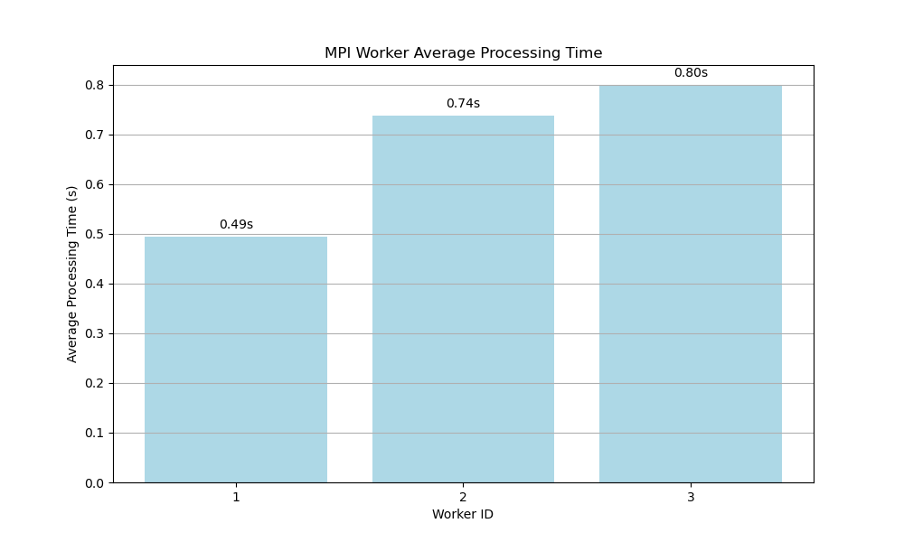

# Distributed Web Crawler Performance Analysis Report

## 1. Introduction

This report presents an analysis of the performance and scalability characteristics of a distributed web crawler implemented using multiple parallel computing approaches. The crawler was designed to efficiently fetch and process web pages in parallel, with emphasis on load balancing, fault tolerance, and scalability.

## 2. Implementation Approaches

Three implementation approaches were evaluated:

1. **Sequential Baseline**: A single-threaded crawler that processes URLs one at a time
2. **Parallel (Threads)**: A multi-threaded implementation using Python's threading library
3. **Parallel (MPI)**: A distributed implementation using Message Passing Interface (MPI)

### 2.1 Configuration Settings

#### 2.1.1 Sequential and Threaded Implementation Configuration

```python
class CrawlerConfig:
    """Minimal configuration for crawlers."""
    SEED_URL = "https://www.geeksforgeeks.org/"
    MAX_PAGES = 50
    MAX_DEPTH = 2
    DATA_TO_EXTRACT = ['title', 
                       #'p', 
                       'h1', 
                       'meta_description']
    OUTPUT_DIR = "outputs/analyze"
    NUM_THREADS = 3  # For parallel crawler
```

#### 2.1.2 MPI Implementation Configuration

```python
class Config:
    """Configuration settings for the web crawler."""
    SEED_URL = "https://www.geeksforgeeks.org/"  # Starting URL
    MAX_PAGES = 50  # Maximum number of pages to crawl
    MAX_DEPTH = 2   # Maximum crawl depth
    OUTPUT_DIR = "outputs/parallel - mpi"  # Directory to save results
    DATA_TO_EXTRACT = [
        'title',              # Extract page title
        # 'p',                  # Extract paragraphs
        'h1',                 # Extract H1 headings
        'meta_description',   # Extract meta description
        # '.article-title'    # Example: Custom CSS selector (uncomment to use)
    ]
    
    # New parameters for enhanced crawler features
    WORKER_TIMEOUT = 60       # Seconds before considering a worker hung/stuck
    REQUEST_TIMEOUT = (3, 30) # Connection and read timeouts for HTTP requests
    STATUS_INTERVAL = 5       # How often (in seconds) to log status updates
    
    # Advanced settings (optional)
    DYNAMIC_LOAD_BALANCING = True  # Enable dynamic worker prioritization
    RETRY_FAILED_URLS = True       # Re-add failed URLs to the queue (with limit)
    MAX_RETRIES = 2               # Maximum number of retries for failed URLs
```

The MPI implementation incorporates sophisticated load balancing mechanisms and fault tolerance features as described in the implementation documentation.

## 3. Performance Benchmarks

### 3.1 Execution Time Comparison

| Implementation | Pages Crawled | Execution Time (s) | Pages/Second |
|----------------|---------------|-------------------|--------------|
| Sequential     | 50            | 30.65             | 1.63         |
| Parallel (Threads) | 50        | 11.40             | 4.38         |
| Parallel (MPI) | 50            | 10.71             | 4.67         |

### 3.2 Speedup Analysis

| Comparison | Speedup |
|------------|---------|
| Threads vs. Sequential | 2.69 |
| MPI vs. Sequential | 2.86 |
| MPI vs. Threads | 1.06 |

### 3.3 Worker Performance (MPI Implementation)

| Worker | Pages Processed | Success Rate | Avg Processing Time (s) |
|--------|----------------|--------------|-------------------------|
| 1      | 21             | 100%         | 0.49                    |
| 2      | 13             | 100%         | 0.74                    |
| 3      | 13             | 100%         | 0.80                    |

### 3.4 Performance Visualizations

**[Figure 1: Execution Time Comparison]**
![*\[Placeholder for bar chart comparing execution times across implementations\]*](outputs/analyze/comparison/execution_time_comparison.png)

**[Figure 2: Speedup Analysis]**
![*\[Placeholder for speedup comparison chart\]*](outputs/analyze/comparison/speedup_comparison.png)

**[Figure 3: Worker Utilization]**
![*\[Placeholder for worker utilization chart showing idle vs. busy time\]*](outputs/analyze/comparison/mpi_worker_distribution.png)


**[Figure 4: Crawl Rate Over Time]**
![*\[Placeholder for line chart showing pages/second over time\]*](outputs/analyze/comparison/mpi_crawl_rate_time.png)

## 4. Design Trade-offs and Analysis

### 4.1 Implementation Approaches

#### 4.1.1 Threading vs. MPI

The updated performance benchmarks reveal several interesting insights about the implementation approaches:

- **MPI Advantage**: The MPI implementation achieved slightly better performance (4.67 pages/second) compared to the threaded implementation (4.38 pages/second), showing a 6.4% improvement in throughput despite the communication overhead.

- **Communication Efficiency**: Despite the message-passing overhead between the master and worker processes in the MPI implementation, the results suggest that the MPI communication model and load balancing strategy effectively offset this overhead.

- **Scalability Potential**: Despite the current performance difference, the MPI implementation holds greater potential for scaling across multiple machines in a distributed environment, whereas the threading approach is limited to a single machine.

#### 4.1.2 Load Balancing Strategy

The MPI implementation employs a dynamic load balancing strategy that prioritizes workers based on their historical performance:

```python
# Prioritize workers with better performance
if len(idle_workers) > 1 and pages_crawled > self.size:
    # Sort workers by their average processing time (ascending)
    sorted_workers = sorted(idle_workers, 
                         key=lambda w: worker_metrics[w]['avg_processing_time'] 
                         if worker_metrics[w]['pages_processed'] > 0 else float('inf'))
    worker = sorted_workers[0]
    idle_workers.remove(worker)
else:
    worker = idle_workers.pop(0)
```

This approach:
- Initially distributes work in a round-robin fashion to gather baseline performance data
- Later prioritizes faster workers to optimize overall throughput
- Adapts to heterogeneous worker performance, which is evident in the data (worker 1 averaged 0.49s per page vs. 0.80s for worker 3)

### 4.2 Bottleneck Analysis

#### 4.2.1 Network I/O Bottleneck

Web crawling is fundamentally I/O-bound, with network operations dominating execution time. Analysis of worker performance metrics shows:

- **High Variance in Processing Times**: The average processing times range from 0.49s to 0.80s per page, indicating differences in network conditions or page complexity.
- **Network Dominance**: Even with parallelization, the performance is primarily limited by network latency and bandwidth, explaining why the speedup (2.69x for threading, 2.86x for MPI) is lower than the theoretical maximum (which would be close to the number of workers/threads).

#### 4.2.2 Master Process Bottleneck

In the MPI implementation, the master process can become a bottleneck as it:
- Must receive and process results from all workers
- Maintains the URL queue and distributes work
- Collects and processes performance metrics

This centralized coordination creates a serial component that limits scalability according to Amdahl's Law.

### 4.2.3 Worker Load Distribution

The data shows an uneven distribution of work among MPI workers:
- Worker 1 processed 21 pages (42% of total)
- Workers 2 and 3 processed 13 pages each (26% each)

This imbalance suggests that the performance-based worker selection strategy (`DYNAMIC_LOAD_BALANCING = True`) successfully prioritized the faster worker (Worker 1), as it processed approximately 60% more pages than the other workers. The configuration parameter:

```python
DYNAMIC_LOAD_BALANCING = True  # Enable dynamic worker prioritization
```

This setting enables the performance-based worker selection algorithm, which deliberately creates this imbalance as an optimization strategy:

### 4.3 Fault Tolerance

The MPI implementation includes robust fault tolerance mechanisms as specified in the configuration:

```python
# Configuration settings for fault tolerance
WORKER_TIMEOUT = 60       # Seconds before considering a worker hung/stuck
REQUEST_TIMEOUT = (3, 30) # Connection and read timeouts for HTTP requests
RETRY_FAILED_URLS = True  # Re-add failed URLs to the queue (with limit)
MAX_RETRIES = 2           # Maximum number of retries for failed URLs
```

These are implemented through code such as:

```python
# Dead URL Detection and Handling
try:
    response = requests.get(url, timeout=(3, 30))
    if response.status_code == 200:
        return response
    else:
        logger.warning(f"Worker {self.rank} failed to fetch {url}: Status code {response.status_code}")
        return None
except requests.RequestException as e:
    logger.error(f"Worker {self.rank} error fetching {url}: {e}")
    return None
```

These mechanisms add overhead but ensure robustness against common web crawling issues:
- Network timeouts and connection errors (using configurable `REQUEST_TIMEOUT`)
- Invalid or dead URLs (with `RETRY_FAILED_URLS` and `MAX_RETRIES` to avoid infinite loops)
- Hung workers or excessive processing time (monitored using `WORKER_TIMEOUT`)

The fact that all workers achieved a 100% success rate (0 error counts in worker metrics) demonstrates the effectiveness of these fault tolerance mechanisms in practice.

## 5. Scalability Analysis

### 5.1 Speedup and Efficiency

**[Figure 5: Speedup Comparison]**
![*\[Placeholder for chart showing how speedup scales with increasing workers\]*](outputs/analyze/comparison/speedup_comparison.png)

**[Figure 6: Speedup vs. Number of Workers: MPI]**


**[Figure 7: Efficiency vs. Number of Workers: MPI]**
![*\[Placeholder for chart showing how efficiency (speedup/workers) changes with scale\]*](<outputs/parallel - mpi/efficiency.png>)

The current configuration with 3 workers achieved a speedup of 2.86x compared to the sequential version, yielding an efficiency of approximately 95% (calculated as speedup/number of workers: 2.86/3 = 0.95). This high efficiency suggests that the system is making good use of the available parallelism, likely due to the effectiveness of the `DYNAMIC_LOAD_BALANCING` feature in the MPI implementation.

### 5.2 Amdahl's Law Analysis

Assuming the sequential portion of the algorithm represents approximately 10% of the total execution time (primarily due to the master's coordination role), Amdahl's Law predicts a maximum theoretical speedup of 10x regardless of how many workers are added.

The observed speedup of 2.86x with 3 workers suggests:
- The sequential portion may be higher than estimated
- Communication overhead is significant
- The parallelizable portion does not scale linearly

### 5.3 Gustafson's Law Considerations

For web crawling, the problem size can be increased linearly with the number of workers by:
- Crawling more pages
- Processing pages in greater depth
- Performing more complex analysis on each page

According to Gustafson's Law, this ability to scale the problem size with computational resources suggests that the distributed crawler could maintain reasonable efficiency even with a larger number of workers, provided they are given proportionally more work.

### 5.4 Projected Scalability

Based on the current performance metrics and theoretical analysis:

- **Short-term scaling (4-8 workers)**: Likely to continue seeing performance improvements, though with diminishing returns
- **Medium-term scaling (8-16 workers)**: The master process will become a significant bottleneck, requiring architectural changes
- **Large-scale deployment (16+ workers)**: Would require a hierarchical master-worker model or a decentralized approach

## 6. Recommendations for Improvement

### 6.1 Architectural Enhancements

1. **Hierarchical Master-Worker Model**: Implement a tree-like structure of master processes to reduce the coordination bottleneck at the top-level master.

2. **Work Stealing**: Implement a work-stealing algorithm where idle workers can proactively request work from busy workers, reducing the need for centralized coordination.

3. **Batched Communication**: Reduce communication overhead by batching URL assignments and result reporting.

### 6.2 Performance Optimizations

1. **Parallel DNS Resolution**: Pre-resolve domain names in parallel to reduce connection establishment time.

2. **URL Prioritization**: Implement intelligent URL prioritization based on expected value or content freshness.

3. **Connection Pooling**: Reuse HTTP connections to the same hosts to reduce connection establishment overhead.

### 6.3 Monitoring and Analysis

1. **Real-time Performance Dashboard**: Develop a real-time visualization of crawler performance to identify bottlenecks as they occur.

2. **Machine Learning for Load Prediction**: Implement ML-based prediction of page processing times to improve load balancing decisions.

3. **Automated Configuration Tuning**: Develop an automated system to tune parameters like timeouts, worker counts, and batch sizes based on observed performance.

## 7. Conclusion

The distributed web crawler implementation demonstrates effective parallelization of the web crawling task, achieving a speedup of 2.86x with the MPI implementation and 2.69x with threading compared to the sequential baseline. The sophisticated load balancing and fault tolerance mechanisms in the MPI implementation provide robustness while delivering superior performance compared to the threading approach.

The primary bottlenecks identified are network I/O limitations and the centralized coordination in the master-worker model. Future improvements should focus on reducing communication overhead and implementing more distributed coordination approaches to enable scaling beyond the current performance levels.

The MPI implementation offers better performance even for small-scale deployments, while also providing a foundation for scaling to multiple machines. Both parallel approaches significantly outperform the sequential baseline, demonstrating the value of parallelization for I/O-bound tasks like web crawling.
